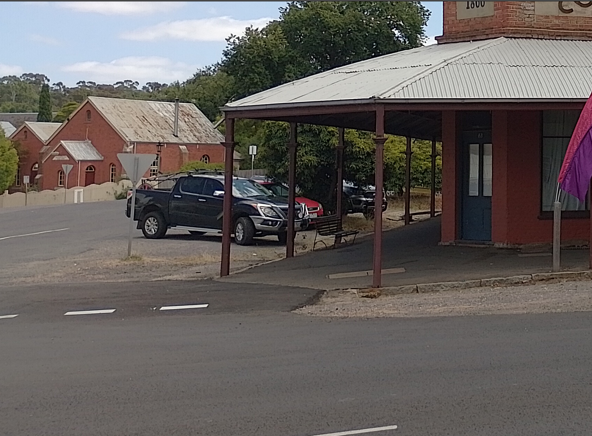

# Comeacroppa, OSINT, Easy

This is a write up by [Cyb0rgSw0rd](https://github.com/AlfredSimpson)

Okay, so this was the easiest one I saw. 

Description:
I was sorting through my photo album and I cannot seem to place this picture. Can you let me know what suburb this is in?

Flag format DUCTF{suburb}

Photo:

# Figure out the end goal

I need to find the suburb

# Look at the evidence

Can't tell much from the photo, just that it's a rustic looking building, # 63 is on the door. The buildings look old, but maintained.

# Take action

I suppose you could try to check the meta data, and I didn't even bother with this one. I just tossed it into Google Image search, and came up with Main St. Traders as the top result:

I saw this was on the maldon museum website, and learned about Maldon. But, that was just for fun, because the answer *was* maldon. Google street view would also give you that answer in confirmation!

# Submit the flag!

DUCTF{maldon}