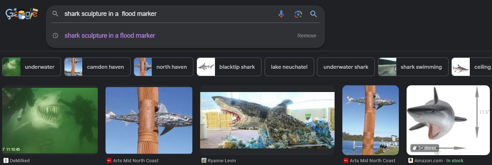

# Shipwrecked

This is a write up by [Cyb0rgSw0rd](https://github.com/AlfredSimpson)

## The challenge

### Description
That bird is mocking me. It should have been a no bird sign! 
 
Where is this location? I'm needing the suburb, all in lowercase ;)
  
Flag format is DUCTF{suburb}.

Author: nosurf

## How I solved this

When I tackle a problem, it's always following the same method: Build the case, examine the evidence, identify presumed key elements in the evidence, take action on that evidence (Get to work!) and then solve the case. 

### Build the case

Okay, so need to identify what the challenge developer wants. All CTF challenges are built to be solved, and this is no different. 

From the description, we can tell we're looking for a suburb. As this an Australian CTF, we might presume it's in Australia, but DUCTF loves to travel (or Bridgette does at least). 

### Examine the evidence

We're given the title, Shipwrecked, a picture (below), and told we need to find a suburb. Not much else to go on off of this.

Here's the picture:

This picture shows a few elements. A bird, a beam with a metal shark in it, and a part of a boat with a flag that's pretty hard to make out.

### Key Elements

Okay, now we have the evidence. What stands out?

Honestly... The metal shark, obviously, but *you* try Googling "metal shark" and tell me what *you* find. Not very helpful. But we can do better!

- Metal shark sculpture
- Beam
- Bird
- Australia (presumably)
- Boat is nearby
- Flag on the boat

These are the key things we can see in the picture. The title might be helpful, but wasn't to me in this case.

### Take Action

Whenever I'm given a photo in any challenge, I do three things:

First, reverse image search it.
Second, check the metadata using exiftool or jimpl.
Third, actually look at the picture and try to figure out what's in it.

I rule out possibilities and find an area to focus on. 

So reverse image searching was useless. nosurf is really good at using images that aren't easily reverse image searched. It's why I love their challenges. It's never *too easy*.

Second, the metadata was bunk. Nothing to go off of here that I saw.

Finally, looking at the picture was going to be our main thing to do. We did that, so now we need to piece the key elements together and use critical thinking to figure out what's what. Did I say **Critical thinking**?! Gasp. A concept, I know.

But it's okay, we can get through this together.

Let's go to Google:
1. Like I said before, Googling "metal shark sculpture" won't do too much for you.
   1. 
   2. Even adding "australia" to that search won't do too much.
2. I did try to figure out the flag - but had no luck whatsoever. I knew the stars in the flag on the boat looked like the stars on the Australian flag, though... so at least we can know it's in Australia. Honestly, I'd love to know where that flag is from. I looked at so many flags for Australia - cities, counties, you name it. 
3. Okay, so if we looked at the above and came up with nothing, how can we get more specific?
   1. Well, the shark sculpture is in a beam... but what kind of beam sits in the water?
   2. The photo is pretty dark, but if you increase the brightness and fiddle with the exposure/contrast, etc, you can make out the letters "FLO". This told me it was most likely a flood marker!
   3. If you didn't modify the image, googling: "pole with markings" in water, you'd find a number of results talking about flood markers.
   4. Now we can google image search a variety of things. Ultimately this is the search that got me where I needed to go:
      1. shark sculpture in a  flood marker
      2. 
4. This will direct us to this article about the [Camden Haven Floodmarkers](https://artsmidnorthcoast.com/listing/camden-haven-floodmarkers/)
   1. This tells us the artist's name, but also says the three suburbs where the floodmarkers are. As this is definitely a shark, we'll see the shark is in a suburb called laurieton.
   2. If you weren't sure, finding the [artist's website](http://www.rickreynolds.info/flood-markers-2006.html), you can  identify which is which. This is absolutely the shark.

### Solve the case

Now that we know where the sculpture is, we just need to submit:

DUCTF{laurieton} will do the trick

## Notes:

Thank you to nosurf and the DUCTF Team! We had a ton of fun with this.