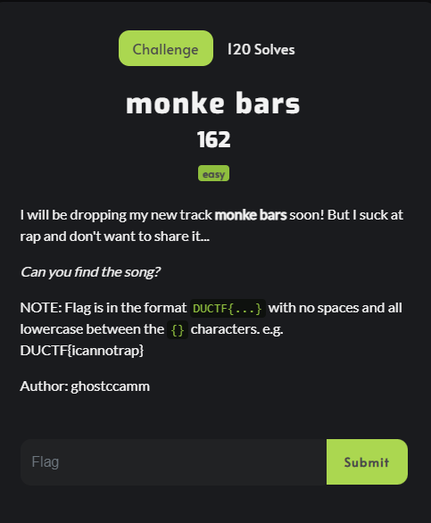
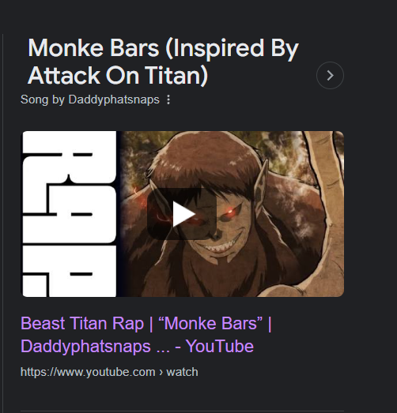
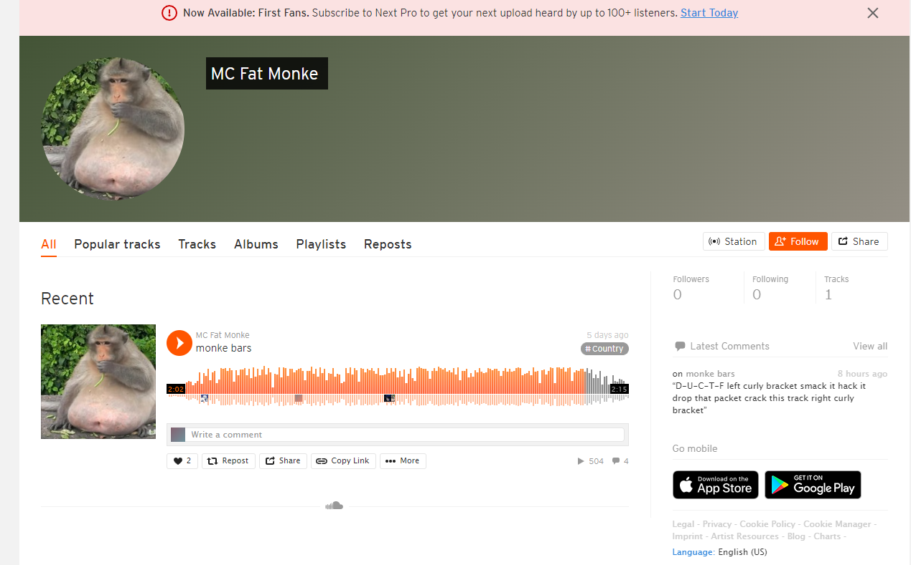

# Monke Bars

This is a write up by [Cyb0rgSw0rd](https://github.com/AlfredSimpson)

## Description

I will be dropping my new track monke bars soon! But I suck at rap and don't want to share it...

Can you find the song?

NOTE: Flag is in the format DUCTF{...} with no spaces and all lowercase between the {} characters. e.g. DUCTF{icannotrap}

Author: ghostccamm

## Steps I took

It wasn't straight forward with *what* we were looking for, all I knew was we needed to find the song.

I checked all of the usual suspects for media: youtube, spotify, twitter (x? nah, still twitter), even TikTok. Unfortunately Monke Bars just popping up with:

And since this was "dropping soon", and the youtube video shown above was 2+ years old? Yeah, not it.

I then went to Bandcamp and Soundcloud. I originally looked for ghostccamm, and then just ccamm, but nothing was popping up... Until:

There it is.

# Submit the flag

DUCTF{smackithackitdropthatpacketcrackthistrack}

Sick beats.