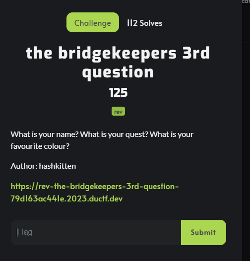
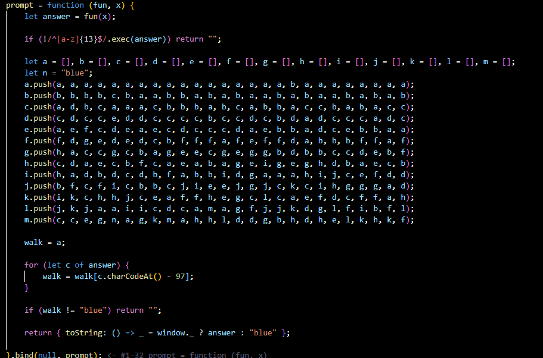

# The Bridgekeepers 3rd Question

This is a write up by [Cyb0rgSw0rd](https://github.com/AlfredSimpson)

It's okay to admit that this took me longer than it should have. To be honest, it was a long night and I was in the middle of applying for internships when a teammate messaged me about it.

We took a look together and I knew it was monty python, but not sure what it would have to do with anything.

Inspecting was obviously the first step, but that initially just linked to the scene it was referring to. I then noticed there was more JavaScript than just in the head.

### The Extra JS in Question

I was scratching my head for a bit and honestly, just needed to walk away from it.

When I came back I started asking "why" - which is key with most rev.

## My why's

1. Why was 13 in the regex? This clearly meant the word we had to enter for our favorite color was 13 characters. Okay, so it won't be blue... what next?
2. Why the arrays? Initially they all just blended together.

## The solution

Coming back I noticed each array had a character in it that was from the next array. This character would never be seen before the previous.

So now we had to figure out all of the indices, and honestly - I'm not about that life. I was for a minute, but I gave up.

I created a python script that would do it for me. I cleaned the text, and then threw it into my script.

My script is simple. It iterates over all arrays, and then all characters in each array. It looks for the highest value character in the array. If it finds it, it adds the value and the *real* letter to my return, and breaks for the next array to start.

## The flag

DUCTF{rebeccapurple}. They could've gone with rebecca black, but no... had to be purple. Well done, folks.