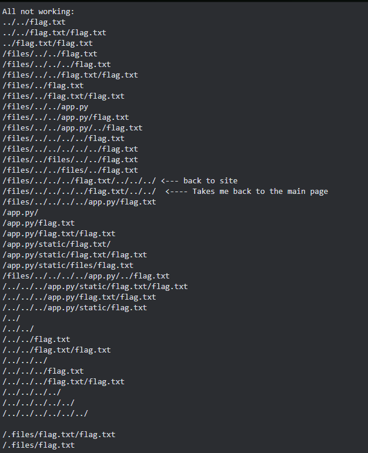
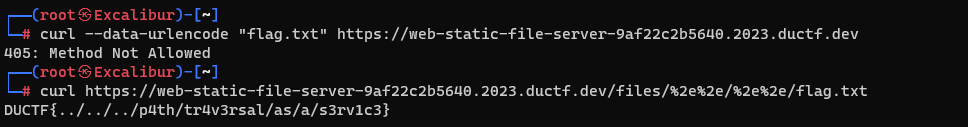
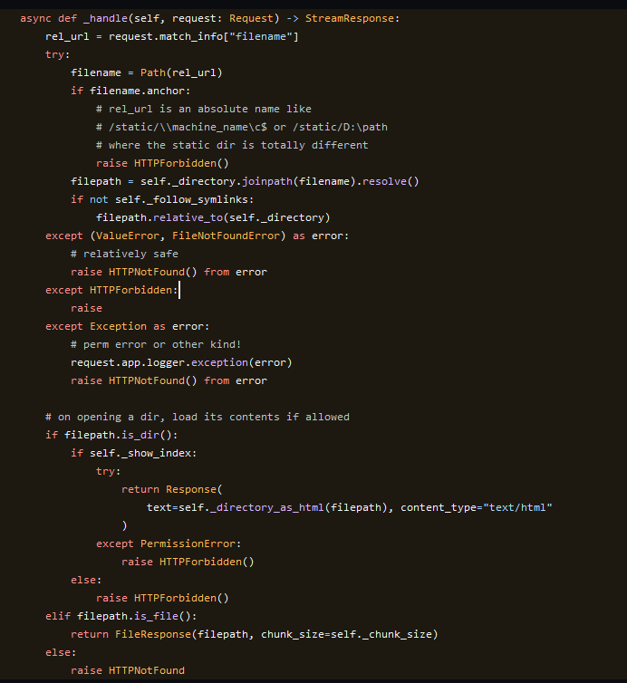

# static file server

This is a write up by [Cyb0rgSw0rd](https://github.com/AlfredSimpson)

Our team was looking at this for a minute, and again, we were overthinking this.

## Examine the evidence:

Okay, so we have a zip file with app.py, dockerfile, files/, a picture in files/, and a txt file in files/.

In Dockerfile there wasn't too much - but we can see it's all python based. 

app.py seemed pretty straight forward, but a comment highlighted a vulnerable piece of a library included. This had to be it. We'll cover more on that soon.

## Act on the evidence:

### Where we failed

We were doing everything straight through a browser. Why? I don't know.

But look at all of the url's we tried. None worked! Eventually it clicked that maybe the browser based approach wasn't going to work.

### How we won:

We eventually switched to using curl, and attempted url-encoding at first through them. No go. Then we just tried it in the url. Bingo. Path traversal and url encoding.

This works because the aiohttp had a vulnerability, which was highlighted in app.py.

[https://github.com/aio-libs/aiohttp/blob/v3.8.5/aiohttp/web_urldispatcher.py#L654-L690](https://github.com/aio-libs/aiohttp/blob/v3.8.5/aiohttp/web_urldispatcher.py#L654-L690)
This was in app.py, and it's what we went off of for our base approach. We were on the right path the whole time - just not using the right tool at first. 

# Submit the flag

We just had to... submit the flag!
DUCTF{../../../p4th/tr4v3rsal/as/a/s3rv1c3}

