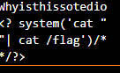

# xxd-server

This is a write up by [Cyb0rgSw0rd](https://github.com/AlfredSimpson)

### Description
I wrote a little app that allows you to hex dump files over the internet.

Author: hashkitten

### Included files:
xxd_server.zip
contained--> 

|-File-|-Description-|
|------|-------------|
|.htaccess|"Everything not a PHP file, should be served as text/plain" with regex |
|Dockerfile| A dockerfile|
|index.php| a php webpage|

## Examine the evidence

  
The main page says we can select a file and upload it.

## Key takeaways

- XXD is for hex dumps
- The dockerfile sets up php 8.1 apache, copies index.php and .htaccess to /var/www/html and places flag in the root directory. It changes apache config to allow .htaccess  overrides and sets specific perms on /var/ww/html/uploads.
- if a file is php, it's served back as plaintext as controlled by htaccess
- Since this is about uploads, index.php requires a closer look. 
- The dockerfile makes changes to apache.

But that wasn't enough.

## How we solved this:

Look, I'm tired. It's 1:30 in the morning as I type this, and when I tell you that I tried... so many different approaches:

You really have no idea. This is *portion* of what I tried. Hell, my whole team (all 3 of us) sat on this for four hours.

I was slamming my head at the wall when I was asked "Why does it give random parsing errors all of the time?"

That's when this was realized:

The hex parser breaks the php up!

Okay, so now we have to rebuild our shell, but account for the shitty parsing.

I took my sample text, test.txt, and copied the line as it was after breaking.

Then, I rebuilt the php shell script using shortened php, multiline comments, and other creative ways to bridge the gap.

Then I uploaded it, and got the flag.

## The flag

There you go. DUCTF{00000000__7368_656c_6c64_5f77_6974_685f_7878_6421__shelld_with_xxd!}