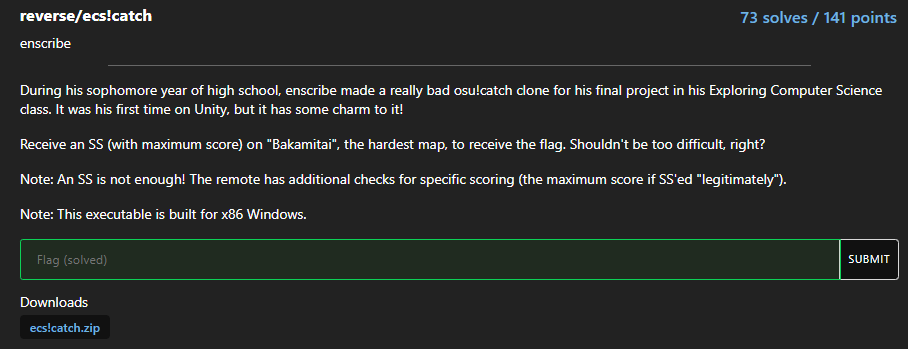
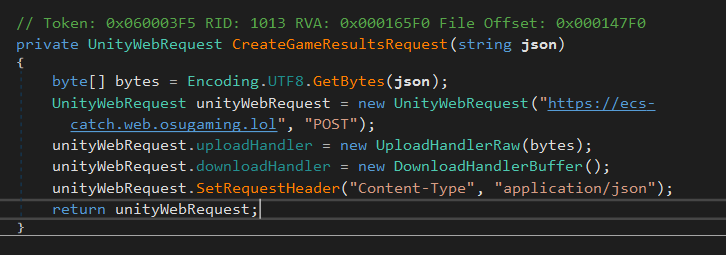
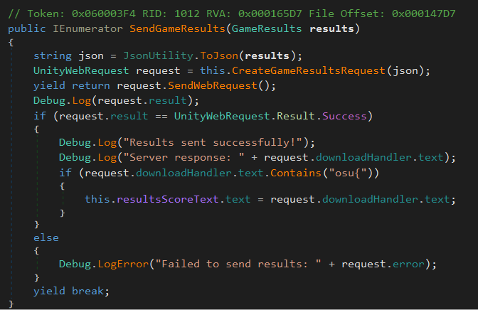
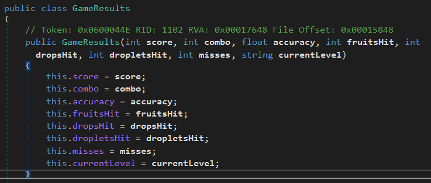
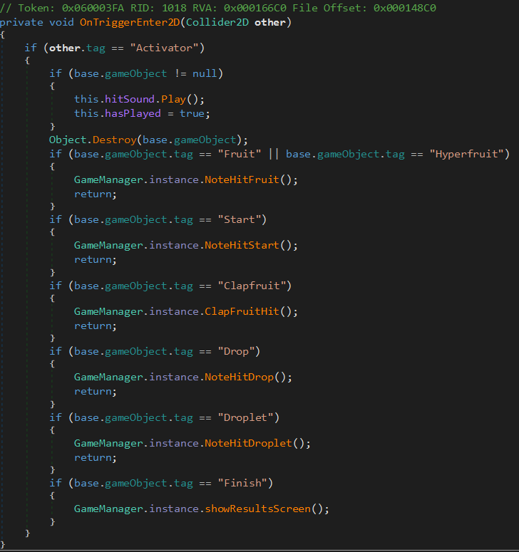
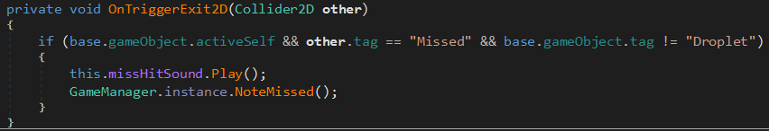
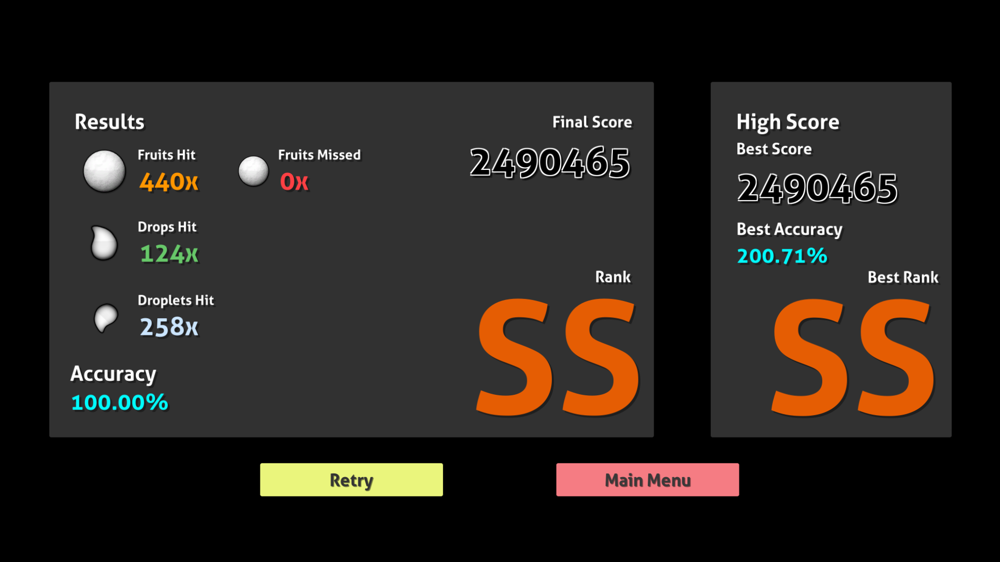
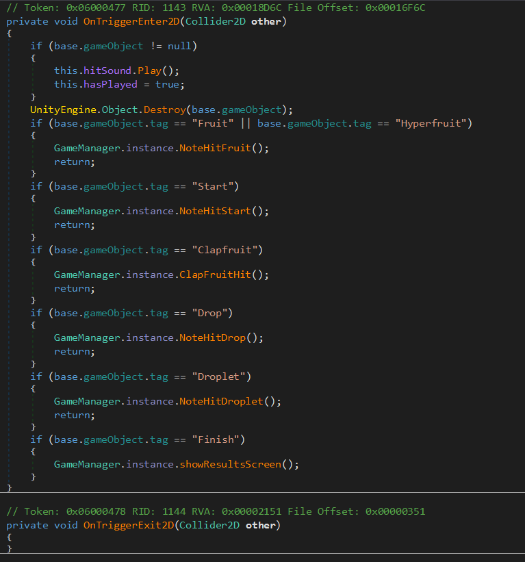

# ecs!catch

This is a write up by [Daniel M.](https://github.com/dmarriello)

To be honest, at first I didn't read the challenge description past the word "Unity". 
I have had experience (mainly from being in a speedrunning community) in reversing Unity games so I expected this to be a breeze... 
I had no clue what I was in for.

## So how did I tackle this?

I first unzipped the given file and located the Assembly-CSharp.dll in the path of ecs!catch_Data\Managed. 
From my prior experience, I knew that this file would contain all of the game logic and could easily be reversed using [dnSpy](https://github.com/dnSpy/dnSpy) (or [ILSpy](https://github.com/icsharpcode/ILSpy), but I have used dnSpy since 2020 so it was a comfort pick).

## What was in that file?

As I mentioned earlier, I hadn't read the full description before jumping in which was definitely foolish of me, as I expected the flag to be around the source code in some "gameWin" sort of function.

After poking around the classes a bit (which is under the section labeled with a - in dnSpy's viewer), I decided to drill down on the GameManager class since I figured that would have most of the actual code regarding the ending of a level and checks for some win condition. 
My hunch was right, as I found 2 methods in GameManager which had GameResults in their names and immediately jumped on them to see what code they had.

## JSON?!

You can imagine how much my heart sank when I saw a POST request with JSON to a remote server to verify the scores. 
No easy flag for me, I have a lot more work to do.

## Two paths emerged

At this point, I had two different ideas for how to continue. 
I could simply forge the outgoing JSON request with something like curl, but I would need to math out the exact values I should have for the score. 
I also found that the score was based on a combo meter and each collectible had different point values, so I would need the order that every collectible falls in. 

Or... I could just mod the game. 
I had a meeting to go to at this point so I was weighing both options mentally while I was there, trying to figure out the most efficient way to solve this.

## The first path (trying to find the right score value)

After getting back to my computer, I went through the process of extracting the assets of the game with [AssetRipper](https://github.com/AssetRipper/AssetRipper). 
I did this because, despite my best efforts, I could not find a list of collectibles that would be used for each map, so I figured they might be in the scene data. 
After getting the extracted files, I realized I had no clue how to read the scene data aside from creating a Unity project and trying to import the files into it, which felt like too much so I put it off and pursued the second path.

## The second path (modding)

I started by looking into [BepInEx](https://github.com/BepInEx/BepInEx) and [Harmony](https://github.com/pardeike/Harmony), since I remembered that they were useful for creating mods of Unity games. 
While I would recommend them for a sophisticated modding environment, I didn't feel like setting all of it up and I realized that there was a much more simple solution for my case. 
dnSpy would simply let me edit the code of a method if I right-clicked it! 
These types of edits worked in my case since they were just for me, but would not fly in a professional environment since distributing an edited version of Assembly-CSharp.dll would essentially be distributing the source code of the game. Not a good idea.

## What are we modding though?

After poking around the GameManager class more, I found the methods that control scoring, which are named NoteHitDrop, NoteHitDroplet, NoteHitFruit, NoteHitStart, and NoteMissed. 
NoteMissed was especially important, as the goal of the challenge is to get a perfect score so this function should never get called. 
Using dnSpy's "Analyze" button on any of these methods, which shows you what methods it calls and what methods call it. This led me to the NoteObject class, which has two methods that control the collision interaction - OnTriggerEnter2D and OnTriggerExit2D.

## The edits in question

My first attempt was to just copy the code from the trigger enter function to the trigger exit function. 
When I hit the compile button, dnSpy gave me an error that the Object.Destroy line was ambiguous. 
I decided to delete the line altogether (a mistake for sure), because I couldn't figure out what it meant (the code was right there, why wouldn't it let me use it?)

I tried booting up the game and moving my player character offscreen to the left but something was wrong... the notes would fall, but they weren't being collected once they went fell down!

I then decided to actually read the code, and I noticed that there was a blatant "activator" check with the first if statement. 
I removed the activator check and tried again. It looked like it worked, but somehow my accuracy score was 200%?!

At this point, I decided to delete all code from OnTriggerExit2D and just remove the first if statement for the activator check in OnTriggerEnter2D.

I ran into the Object being ambiguous error again, but I decided to search it up and found out that all I had to do was add UnityEngine. before the Object.Destroy line.

This worked perfectly, and after listening to Baka Mitai for 2 minutes, I got the flag on the results screen.

Also yes, it was essentially a 5 line fix. Super straightforward.

## The flag

osu{h0pefu11y_th1s_4ss1gnm3nt_g3ts_m3_an_A}. It sure got full marks from me. A+ challenge.